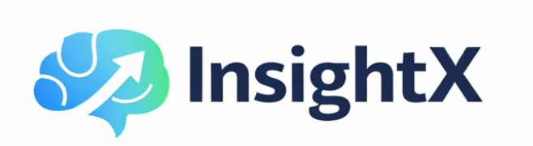

<div align="center">



</div>

> AI-powered trader education: build strategies visually, run bots, and learn from every trade with Analyst and Tutor agents.

---

> **Note — Frontend base**  
> The frontend is built on top of the **[Deriv Bot (dbot-reference)](https://github.com/deriv-com/dbot-reference)** GitHub repo (visual trading bot with Blockly, Deriv API, and SmartCharts). InsightX extends it with the Agent Analysis integration (Analyst & Tutor, RAG, chart capture, and AI summary in the UI).

---

<table>
<tr>
<td width="50%">

**Frontend & build**


</td>
<td width="50%">

**Backend & data**


</td>
</tr>
<tr>
<td width="50%">

**AI & APIs**


</td>
<td width="50%">

**Deploy & host**


</td>
</tr>
</table>

## Table of Contents

- [Core problem](#core-problem)
- [Features](#features)
- [Platform & APIs at a glance](#platform--apis-at-a-glance)
- [Design](#design)
- [Project guidelines](#project-guidelines)
- [Setup](#setup)
- [Vercel (frontend)](#vercel-frontend)
- [Google Cloud (backend)](#google-cloud-backend)
- [Testing](#testing)
- [Troubleshooting](#troubleshooting)

---

## Core problem

Traders need to **automate strategies and learn from outcomes** without writing code. Existing tools either assume programming skills or offer no structured way to understand why a trade won or lost. The result:

- **Barrier to automation** – Strategy logic is locked in code; non-developers can’t build or tweak bots.
- **Shallow feedback** – P&L and logs don’t explain context, risk, or decision quality.
- **No personalised education** – Generic tutorials don’t tie lessons to the user’s own trades and strategy intent.

**InsightX** addresses this by combining a **visual bot builder** (Blockly + Deriv API) with an **agent-based education backend**: an **Analyst** agent analyses each trade objectively for learning, and a **Tutor** agent turns that into personalised explanations and follow-up. Traders build strategies in a drag-and-drop workspace, run them against live markets, and get AI-powered analysis and education grounded in their actual trade data and charts.

---

## Features

- **Analyst agent** – Deep, objective analysis of individual trades: what happened, key factors, win/loss drivers. Uses contract data, strategy intent, behavioral context (e.g. trade index in run, recent outcomes), and optional chart screenshot. Outputs structured JSON (trade_analysis, key_factors, win_loss_assessment) for learning.
- **Tutor agent** – Personalised trade explanation and learning points from Analyst output. Plain-language explanation plus bullet learning points; explanations saved to disk and linked in DB.
- **AI summary in UI** – Per-trade “Analyse with AI” (Analyst → Tutor) and “Learn from trade” (RAG) flows. Displays trade explanation, learning recommendation, learning points, and optional source citations (Deriv blog) in the transaction/contract view.
- **Chart capture for AI** – SmartCharts capture with entry/exit and P/L overlay; screenshot sent with analysis request or stored for later. Backend can reuse stored chart image when re-analysing.
- **Persistence** – PostgreSQL stores transactions (contract, strategy intent, behavioral summary, optional chart image) and analysis results (Analyst + Tutor outputs).
- **RAG (Learn from trade)** – Retrieval-augmented learning over ingested content (e.g. Deriv blog). Uses **NVIDIA AI Endpoints** for embeddings (`baai/bge-m3`) and LLM (`meta/llama-3.3-70b-instruct`), with LangChain and FAISS for vector search. “Learn from trade” returns context-aware learning points and source citations; falls back to general guidance when context is insufficient.

---

## Platform & APIs at a glance

*Click a row to expand details.*

<details>
<summary><b>Frontend host</b> — Vercel</summary>

| | |
|-|-|
| **Purpose** | Serve React SPA; root build, output `apps/frontend/dist`. |
| **Docs** | [Vercel](https://vercel.com/docs) |

</details>

<details>
<summary><b>Backend host</b> — Google Cloud Run</summary>

| | |
|-|-|
| **Purpose** | Run Agent Analysis API (FastAPI); scale-to-zero, Cloud SQL private IP. |
| **Docs** | [Cloud Run](https://cloud.google.com/run/docs), [scripts/gcloud/README.md](scripts/gcloud/README.md) |

</details>

<details>
<summary><b>Trading & market data</b> — Deriv API</summary>

| | |
|-|-|
| **Purpose** | Auth (OAuth), WebSocket, contract lifecycle, execution. |
| **Docs** | [Deriv API](https://deriv.com), [developers.deriv.com](https://developers.deriv.com) |

</details>

<details>
<summary><b>Analyst & Tutor agents</b> — Google Gemini</summary>

| | |
|-|-|
| **Purpose** | Trade analysis (structured JSON) and personalised explanations + learning points. |
| **Env** | `GEMINI_API_KEY` |
| **Docs** | [Google AI for developers](https://ai.google.dev/) |

</details>

<details>
<summary><b>RAG (embeddings + LLM)</b> — NVIDIA AI Endpoints + FAISS</summary>

| | |
|-|-|
| **Purpose** | “Learn from trade”: embed query + docs (`baai/bge-m3`), retrieve from FAISS, generate answer (`meta/llama-3.3-70b-instruct`). Source citations (e.g. Deriv blog). |
| **Env** | `API_KEY` (NVIDIA), optional `BINDING_HOST` |
| **Docs** | [NVIDIA AI Endpoints](https://build.nvidia.com/explore/ai-endpoints) |

</details>

<details>
<summary><b>Database</b> — PostgreSQL (Cloud SQL)</summary>

| | |
|-|-|
| **Purpose** | Transactions (contract, strategy intent, chart image), analysis results (Analyst + Tutor outputs). |
| **Docs** | [Cloud SQL](https://cloud.google.com/sql/docs) |

</details>

---

## Design

### Architecture

- **Frontend** – React 18, TypeScript, MobX (RootStore), RSBuild. Blockly for the bot builder; Deriv API for trading. Main app lives in `apps/frontend` and deploys to Vercel. *(Built on top of the [Deriv Bot (dbot-reference)](https://github.com/deriv-com/dbot-reference) repo.)*
- **Backend** – FastAPI (Python 3.10+). Analyst and Tutor agents use Google Gemini; RAG uses NVIDIA AI Endpoints (embeddings + LLM) and FAISS. PostgreSQL (Cloud SQL in production) for persistence. Deploys to Google Cloud Run. See [apps/backend](apps/backend).
- **Shared** – `packages/shared` holds shared TypeScript (e.g. education API types) used by the frontend.

### Monorepo layout

| Path | Role |
|------|------|
| **apps/frontend** | React app: components, pages (Dashboard, Bot Builder, Chart, Tutorials), stores, Blockly/bot-skeleton, RSBuild config. |
| **apps/backend** | FastAPI app: agents (Analyst, Tutor), db (SQLAlchemy/PostgreSQL), routes, RAG services. |
| **packages/shared** | Shared TypeScript (education API, strategy intent, etc.). |
| **scripts/gcloud** | GCP scripts: Cloud Run + Cloud SQL + Secret Manager. See [scripts/gcloud/README.md](scripts/gcloud/README.md). |

### Tech stack

**Frontend:** React 18, TypeScript, MobX, React Router, RSBuild, Sass, Blockly, SmartCharts, @deriv-com/ui, @deriv/deriv-api. Jest, React Testing Library, ESLint, Prettier, Husky.

**Backend:** Python 3.10+, FastAPI, Uvicorn, SQLAlchemy, PostgreSQL (psycopg2), Google GenAI (Gemini), LangChain, langchain-nvidia-ai-endpoints, FAISS, Pydantic. Managed with [uv](https://docs.astral.sh/uv/).

### Project structure (high level)

```
apps/
├── frontend/           # React UI
│   ├── src/
│   │   ├── components/, pages/, stores/
│   │   ├── external/bot-skeleton/   # Blockly blocks & bot runtime
│   │   └── ...
│   ├── rsbuild.config.ts
│   └── vercel.json
├── backend/            # Agent Analysis API
│   ├── src/
│   │   ├── agents/     # Analyst, Tutor
│   │   ├── db/         # Models, CRUD, engine
│   │   ├── routes/     # analysis, transactions
│   │   ├── services/   # RAG, etc.
│   │   └── main.py
│   ├── pyproject.toml
│   ├── Dockerfile
│   └── cloudbuild.yaml
packages/
└── shared/             # Shared TS types
scripts/
└── gcloud/             # Backend deploy (Cloud Run + Cloud SQL)
```

---

## Project guidelines

### Contributing

1. Fork the repo and create a feature branch: `git checkout -b feature/your-feature`.
2. Make changes, run tests (`npm test`) and lint (`npm run test:lint`).
3. Commit with a **conventional commit** and a **single-line subject** (e.g. `feat: add X`, `fix: resolve Y`). Do not add `Co-authored-by:` or other trailers unless explicitly required.
4. Push and open a Pull Request.

### Code standards

- TypeScript: follow project patterns; use functional components and hooks.
- Write tests for new behaviour; keep existing naming and structure.
- Update docs when changing behaviour or setup.

### Git workflow

- **Conventional commits:** `feat:`, `fix:`, `docs:`, `style:`, `refactor:`, `test:`.
- One logical change per commit; single-line subject. Rebase feature branches before merge.

---

## Setup

### Prerequisites

- **Node.js 20.x** and **npm 9.x** – for the frontend.
- **Python 3.10+** and **[uv](https://docs.astral.sh/uv/)** – only if you run the backend locally.
- **git** – version control.

### Install and run (frontend)

```sh
git clone <repository-url>
cd ai-trader-education-bot
npm install
npm run build
npm start
```

App: **https://localhost:8443/** (or the port RSBuild reports).

### Run backend locally (optional)

```sh
# From repo root
npm run dev:agent
```

- Backend runs at **http://localhost:8000**.
- Copy `apps/backend/.env.example` → `apps/backend/.env` and set **GEMINI_API_KEY** (and optionally DB settings). See [apps/backend/.env.example](apps/backend/.env.example) and [scripts/gcloud/README.md](scripts/gcloud/README.md).

### Environment variables (quick ref)

**Frontend** – `apps/frontend/.env` (or root `.env`):

- **DERIV_APP_ID** (optional) – Use [Deriv third-party OAuth](https://developers.deriv.com/docs/authentication) and public WebSocket API when set. Register at [api.deriv.com](https://api.deriv.com), set OAuth redirect URL to your app origin.
- **AGENT_ANALYSIS_API_URL** (optional) – When unset, frontend uses same-origin `/api` (proxy to backend). When set (e.g. Cloud Run URL or `http://localhost:8000`), frontend calls the backend at that URL.

**Backend** – `apps/backend/.env`:

- **GEMINI_API_KEY** – Required for Analyst/Tutor (Google Gemini).
- **API_KEY** – Required for RAG (NVIDIA AI Endpoints). Used for embeddings and LLM in “Learn from trade”. Get an API key at [NVIDIA AI Endpoints](https://build.nvidia.com/explore/ai-endpoints).
- **BINDING_HOST** (optional) – Default `https://integrate.api.nvidia.com/v1`. Override if using a different NVIDIA endpoint.
- For production GCP, see [scripts/gcloud/README.md](scripts/gcloud/README.md) for `GCP_PROJECT`, `GCP_REGION`, `DATABASE_URL`, and secret names (`nvidia-api-key`, etc.).

### Root scripts

| Command | Description |
|--------|-------------|
| `npm start` | Dev server (frontend, hot reload) |
| `npm run build` | Production build (frontend) |
| `npm run watch` | Build in watch mode |
| `npm run serve` | Serve production build locally |
| `npm run dev:agent` | Run backend locally (port 8000) |
| `npm run deploy` | Deploy frontend to Vercel (production) |
| `npm run deploy:preview` | Deploy frontend to Vercel (preview) |
| `npm test` | Run Jest tests (frontend) |
| `npm run coverage` | Coverage report |
| `npm run test:lint` | Lint + format check |
| `npm run test:fix` | Auto-fix lint/format |
| `npm run build:analyze` | Bundle size analysis |

---

## Vercel (frontend)

The frontend is one workspace in a **monorepo**. Deploy from the **repository root** so `packages/shared` and root config are available.

### Config

- **Root directory:** Leave empty in Vercel (use repo root).
- **Build:** Root [vercel.json](vercel.json) defines:
  - **Install:** `npm ci`
  - **Build:** `npm run build`
  - **Output:** `apps/frontend/dist`
  - SPA rewrites: `/*` → `index.html`

### Deploy

From repo root:

```sh
vercel link          # link to your Vercel project
npm run deploy       # production
# or
vercel --prod
```

For previews: `npm run deploy:preview` or `vercel` (no `--prod`).

### Important

- Do **not** set Vercel Root Directory to `apps/frontend` and do **not** run `vercel` from inside `apps/frontend`. The root install would fail and the monorepo would be incomplete.
- If you see `Command "cd ../.. && npm ci" exited with 1`, run from repo root or clear any custom Install Command in Vercel so the root [vercel.json](vercel.json) is used.

### Frontend env on Vercel

Set in Vercel project → Settings → Environment Variables:

- **AGENT_ANALYSIS_API_URL** – Your backend URL (e.g. Cloud Run) so the frontend can call the Agent Analysis API. Omit if you rely on same-origin proxy.

## Google Cloud (backend)

The backend runs on **Cloud Run** with **Cloud SQL (PostgreSQL)** and **Secret Manager**. Scripts live in **scripts/gcloud/**; full details in [scripts/gcloud/README.md](scripts/gcloud/README.md).

### Prerequisites

- [gcloud CLI](https://cloud.google.com/sdk/docs/install) installed and logged in (`gcloud auth login`, `gcloud auth application-default login`).
- **Docker** (for local image build), or use Cloud Build.
- A **GCP project** and **GEMINI_API_KEY**.

### One-time setup (order matters)

Use a single env file: **apps/backend/.env**. Copy from `apps/backend/.env.example` and set at least `GCP_PROJECT`, `GCP_REGION`, `GEMINI_API_KEY`, and `API_KEY` (NVIDIA, for RAG). Scripts source this file when present.

From repo root or `scripts/gcloud/`:

1. **setup-project.sh** – Enable APIs, Artifact Registry, service account `backend-runner` (Cloud SQL Client + Secret Manager).
2. **setup-database.sh** – Create Cloud SQL PostgreSQL instance, DB `trader_edu`, user; store password and `DATABASE_URL` in Secret Manager. (Can take several minutes.)
3. **setup-secrets.sh** – Create secrets for `GEMINI_API_KEY` (agents) and `API_KEY` (NVIDIA, for RAG); grant backend service account access. Set **API_KEY** in `apps/backend/.env` for the NVIDIA API key before running.
4. **build-and-push.sh** – Build backend Docker image and push to Artifact Registry (needs Docker).
5. **deploy.sh** – Deploy to Cloud Run with Cloud SQL and secrets. Requires `IMAGE` and `CLOUD_SQL_CONNECTION_NAME` in `apps/backend/.env` (outputs from steps 2 and 4).

Example (first time):

```sh
cp apps/backend/.env.example apps/backend/.env
# Edit: GCP_PROJECT, GCP_REGION, GEMINI_API_KEY, API_KEY (NVIDIA for RAG)

cd scripts/gcloud
./setup-project.sh
./setup-database.sh
./setup-secrets.sh
./build-and-push.sh

# Add to apps/backend/.env (from script output):
# IMAGE=...
# CLOUD_SQL_CONNECTION_NAME=...
./deploy.sh
```

`deploy.sh` prints the Cloud Run service URL. Set **AGENT_ANALYSIS_API_URL** in Vercel (or your frontend host) to this URL.

### Build image in GCP (no local Docker)

```sh
gcloud builds submit --config=apps/backend/cloudbuild.yaml apps/backend
```

Then set `IMAGE` in `apps/backend/.env` to the built image URL and run `./deploy.sh`.

### Required env for gcloud scripts

| Variable | When | Description |
|----------|------|-------------|
| `GCP_PROJECT` | All | GCP project ID. |
| `GCP_REGION` | All | e.g. `europe-west1`. |
| `GEMINI_API_KEY` | setup-secrets | Gemini API key for Analyst/Tutor. |
| `API_KEY` | setup-secrets | NVIDIA API key for RAG (stored as secret `nvidia-api-key`). |
| `IMAGE` | deploy | Full image URL (e.g. from build-and-push or Cloud Build). |
| `CLOUD_SQL_CONNECTION_NAME` | deploy | `PROJECT:REGION:INSTANCE` (from setup-database.sh). |

More options in [apps/backend/.env.example](apps/backend/.env.example) and [scripts/gcloud/README.md](scripts/gcloud/README.md).

---

## Testing

Frontend tests (Jest + React Testing Library) from repo root:

```sh
npm test
npm run coverage
npm test -- --watch
npm test -- dashboard.spec.tsx
```

---

## Troubleshooting

- **Dev server won’t start:** `npm cache clean --force`, remove `node_modules` and `package-lock.json`, then `npm install`.
- **Build fails:** Ensure Node 20.x (`node --version`). Try `rm -rf dist` then `npm run build`.
- **Blockly issues:** Use a browser with Web Workers; check console; refresh to reinit workspace.
- **WebSocket/API errors:** Check network and env (DERIV_APP_ID, AGENT_ANALYSIS_API_URL).
- **Backend / agents not responding:** Ensure `apps/backend/.env` exists with **GEMINI_API_KEY**. For DB features, set `DATABASE_URL` or complete gcloud setup (see [scripts/gcloud/README.md](scripts/gcloud/README.md)).
- **RAG / “Learn from trade” fails:** Set **API_KEY** (NVIDIA) in `apps/backend/.env`. For Cloud Run, run `setup-secrets.sh` with `API_KEY` set so the `nvidia-api-key` secret is created. Ensure the FAISS index exists (run ingestion: `python -m search.ingestion` from repo root).

**Performance:** Use `npm run build:analyze` for bundle size; consider React.lazy and DevTools Profiler for render hotspots.

---

For issues and questions, use the project’s issue tracker or contact the team.
